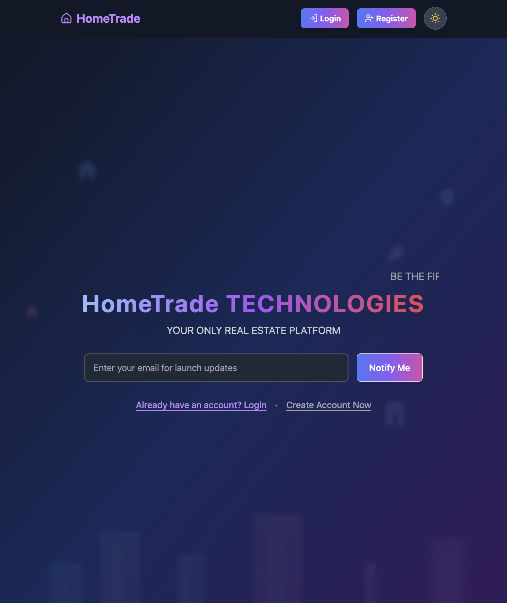

# HomeTrade MVP

<div align="center">
  
</div>

**HomeTrade** is a web-based real estate platform built as a minimum viable product (MVP). It enables **buyers** to discover and filter listings and **sellers** to list and manage properties — all within a modern, responsive user interface.  

## 🧩 Core Features

- Role-based authentication: users register as *buyer* or *seller* and see tailored flows.  
- Secure login & onboarding: account creation, role selection, and initial setup personalize the experience.  
- Property listing form for sellers: add title, city, price, bedrooms, type, description and image.  
- Full search & filter functionality for buyers: list view, interactive filters (price, type, city, bedrooms) and map or grid layouts.  
- Responsive navigation: desktop top navbar + mobile bottom bar for seamless navigation on any screen.  
- Theme toggle with animations: light/dark mode switch featuring smooth transitions, icon animation, and a gradient glow pulse.  
- Persistent storage for MVP: uses `localStorage` to mock backend persistence (users, listings, onboard data).  
- Stylish UI built with Tailwind CSS + Framer Motion animations for polished look & feel.  
- Hooks & context architecture:  
  - `useAuth()` handles authentication state, roles and logout.  
  - `useTheme()` manages theme state, toggle logic and transitions.  
  - Components respond to role and auth state to conditionally render seller vs buyer UI.  

## 🖥️ Tech Stack LOGOS
<p align="center">
  <a href="https://developer.mozilla.org/en-US/docs/Web/JavaScript" target="_blank" rel="noreferrer"></a>
  <a href="https://reactjs.org/" target="_blank" rel="noreferrer"></a>
  <a href="https://vitejs.dev/" target="_blank" rel="noreferrer"></a>
  <a href="https://tailwindcss.com/" target="_blank" rel="noreferrer"></a>
  <a href="https://lucide.dev/" target="_blank" rel="noreferrer"></a>
</p>

## 🖥️ Tech Stack
- **JavaScript (ES6+)** – Modern JavaScript with arrow functions, destructuring, async/await, modules
- **React** (Vite) – modern frontend library and build tool  
- **Tailwind CSS** – utility-first styling framework  
- **Framer Motion** – animations and transitions  
- **React Router** – client-side routing  
- **Lucide React** – icon library  
- **LocalStorage** – simple persistence layer for MVP phase  
- CSS custom keyframes & animations for gradient flows and hover effects  
- Optional blockchain/escrow paths planned in future phases  

## 🚀 Getting Started

1. Clone the repo:  
   ```bash
   git clone https://github.com/marlonmunoz/home-trade-MVP-app.git
   cd home-trade-MVP-app/client/hometrade_mvp
   ```
2. Install dependencies:
   ```bash
   npm install
   ```

3. Start the development server:
   ```bash
   npm run dev
   ```
Open your browser to http://localhost:5173/ and explore the app.

Log in or register (choose buyer/seller) and test flows:

* Seller: add property → view your listings

* Buyer: browse listings → use filters → save favorites

## 📂 Project Structure (abridged)
```bash
/src
  /components        ← Navbar, ThemeToggle, etc.
  /contexts          ← AuthContext, ThemeContext
  /pages             ← Login.jsx, Register.jsx, Dashboard.jsx, 
                     ← Onboarding.jsx, AddProperty.jsx, 
                     ← AllProperties.jsx,     
                     ← MyListings.jsx
  /utils             ← helper functions, constants
  index.css          ← Tailwind imports and custom animations
  main.jsx           ← app bootstrap

```
## 🎯 Next Steps & Future Roadmap
* Implement backend integration: replace localStorage with REST API (Node.js/Express or FastAPI + PostgreSQL).

* Add property detail pages (/property/:id) with full info and contact mode.

* Introduce map view, favorites and AI-driven suggestions for buyers.

* Explore smart contract / escrow flows and blockchain transaction logs for verified deals.

* Performance polish, mobile UX adjustment, accessibility enhancements and deployment (Vercel/Netlify + AWS/RDS).

## 📄 License & Credits
Built and maintained by Marlon Muñoz.
Open for collaboration — feel free to file issues or pull requests.


## RUN client
1. `client/hometrade_mvp/src`
2. `npm install`
3. `nvm use 22`
4. `npm run dev`

## RUN server (JSON server for api simulation)
1. `client/hometrade_mvp`
2. `json-server --watch db.json --port 3001`

JSON Server started on PORT :3001
Press CTRL-C to stop
Watching db.json...

Endpoints:
`http://localhost:3001/properties`


## DEPLOYING
`home-trade-MVP-app/client/hometrade_mvp`
`npm run deploy`

